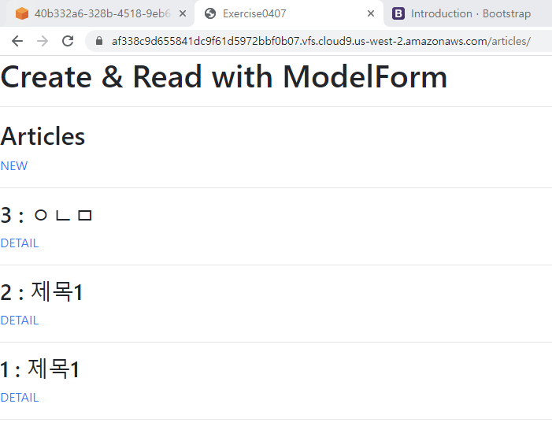
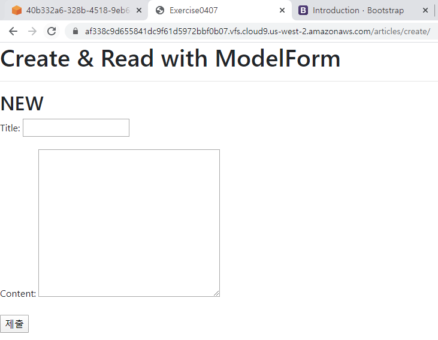
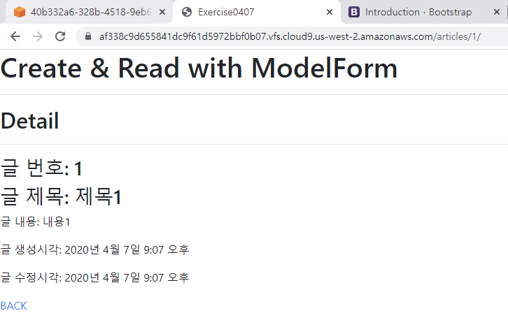

# 4월 7일 exercise

* Create & Read(index)

  

* Create

  

* Detail

  

### 1.  views.py

```python
from django.shortcuts import render, redirect, get_object_or_404
from .models import Article
from .forms import ArticleForm

# Create your views here.
def index(request):
    articles = Article.objects.order_by('-pk')
    context = { 'articles': articles }
    return render(request, 'articles/index.html', context)

def create(request):
    if request.method == 'POST':
        form = ArticleForm(request.POST)
        if form.is_valid():
            article = form.save()
            return redirect('articles:index')
    else:
        form = ArticleForm()
    # 아래 context가 활용되는 경우는
    # 1. GET 요청 -> ArticleForm()
    # 2. POST 요청 + invalid -> ArticleForm(request.POST)
    context = {
        'form': form
    }
    return render(request, 'articles/create.html', context)

def detail(request, pk):
    article = get_object_or_404(Article, pk=pk)
    context = { 'article': article }
    return render(request, 'articles/detail.html', context)
```


### 2. forms.py

```python
from django import forms
from .models import Article

class ArticleForm(forms.ModelForm):
    class Meta:
        model = Article
        fields = '__all__'
```


### 3. index.html

```html



    <h2>Articles</h2>
    <a href="">NEW</a>
    <hr>
    
        <h3>{{ article.pk }} : {{ article.title }}</h3>
        <a href="">DETAIL</a>
        <hr>
    



```


### 4. create.html

```html



    <h2>NEW</h2>
    <form action="" method='POST'>
        
        {{ form.as_p }}
        <input type="submit" value="제출">
    </form>

```


### 5. detail.html

```html



    <h2>Detail</h2>
    <hr>
    <h3>글 번호: {{ article.pk }}</h3>
    <h3>글 제목: {{ article.title }}</h3>
    <p>글 내용: {{ article.content }}</p>
    <p>글 생성시각: {{ article.created_at }}</p>
    <p>글 수정시각: {{ article.updated_at }}</p>
    <a href="">BACK</a>

```

