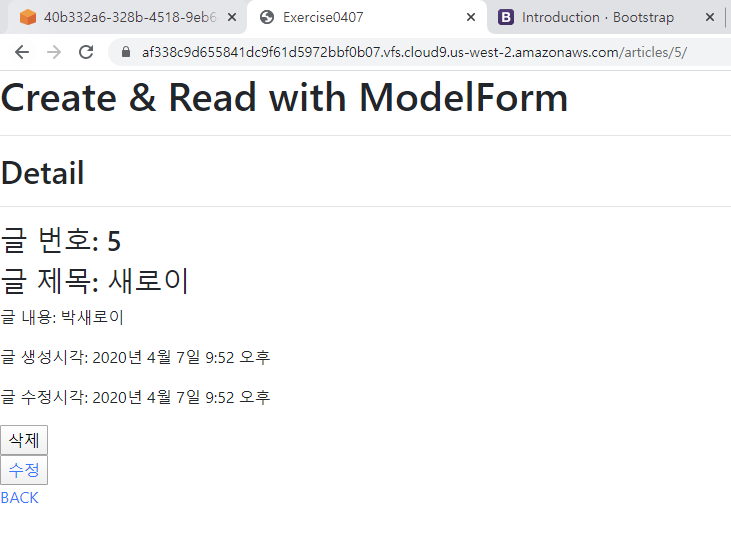
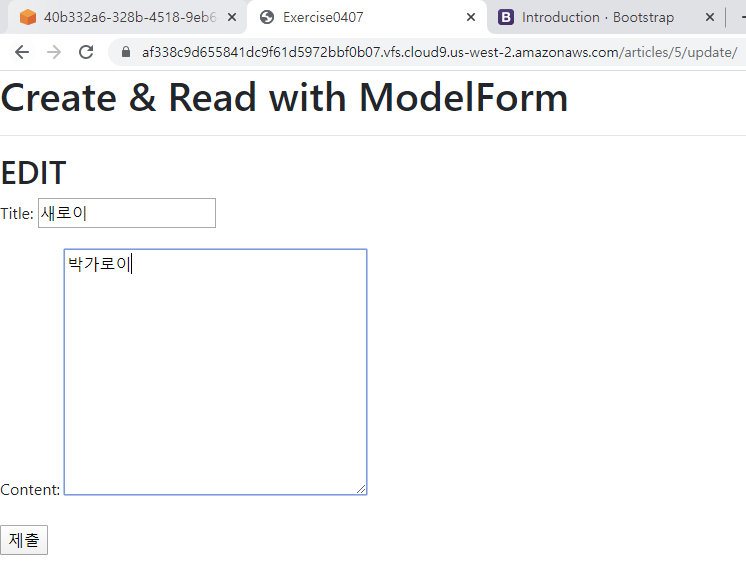
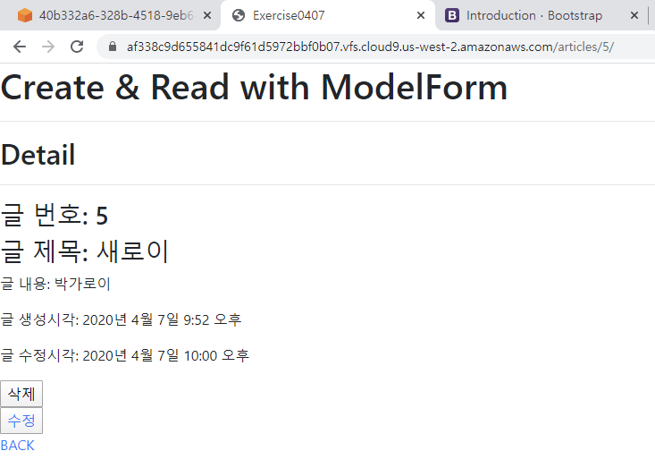

# 4월 7일 workshop

* Detail

  

* Edit

  

* after Edit

  

### 1. views.py

```python
from django.shortcuts import render, redirect, get_object_or_404
from django.views.decorators.http import require_POST
from .models import Article
from .forms import ArticleForm

# Create your views here.
def index(request):
    articles = Article.objects.order_by('-pk')
    context = { 'articles': articles }
    return render(request, 'articles/index.html', context)

def create(request):
    if request.method == 'POST':
        form = ArticleForm(request.POST)
        if form.is_valid():
            article = form.save()
            return redirect('articles:index')
    else:
        form = ArticleForm()
    # 아래 context가 활용되는 경우는
    # 1. GET 요청 -> ArticleForm()
    # 2. POST 요청 + invalid -> ArticleForm(request.POST)
    context = {
        'form': form
    }
    return render(request, 'articles/form.html', context)

def detail(request, pk):
    article = get_object_or_404(Article, pk=pk)
    context = { 'article': article }
    return render(request, 'articles/detail.html', context)

@require_POST
def delete(request, pk):
    article = get_object_or_404(Article, pk=pk)
    article.delete()
    return redirect('articles:index')

def update(request, pk):
    article = get_object_or_404(Article, pk=pk)
    if request.method == 'POST':
        form = ArticleForm(request.POST, instance=article)
        if form.is_valid():
            article = form.save()
            return redirect('articles:detail', article.pk)
    else:
        form = ArticleForm(instance=article)
    context = {
        'form' : form
    }
    return render(request, 'articles/form.html', context)
```

### 2. forms.py

```python
from django import forms
from .models import Article

class ArticleForm(forms.ModelForm):
    class Meta:
        model = Article
        fields = '__all__'
```

### 3. detail.html

```html



    <h2>Detail</h2>
    <hr>
    <h3>글 번호: {{ article.pk }}</h3>
    <h3>글 제목: {{ article.title }}</h3>
    <p>글 내용: {{ article.content }}</p>
    <p>글 생성시각: {{ article.created_at }}</p>
    <p>글 수정시각: {{ article.updated_at }}</p>
    <form action='' method="POST">
        
        <input type="submit" value='삭제'>
    </form>
    <button><a href="">수정</a></button><br>
    <a href="">BACK</a>

```

### 4. delete.html

```html



    <h2>Detail</h2>
    <hr>
    <h3>글 번호: {{ article.pk }}</h3>
    <h3>글 제목: {{ article.title }}</h3>
    <p>글 내용: {{ article.content }}</p>
    <p>글 생성시각: {{ article.created_at }}</p>
    <p>글 수정시각: {{ article.updated_at }}</p>
    <form action='' method="POST">
        
        <input type="submit" value='삭제'>
    </form>
    <button><a href="">수정</a></button><br>
    <a href="">BACK</a>

```

### 5. form.html

```html



    
        <h2>NEW</h2>
    
        <h2>EDIT</h2>
    
    <form action="" method="POST">
        
        {{ form.as_p }}
        <input type='submit' value="제출">
    </form>

```

### 6. templates/articles/index.html

```html



<a href="/articles/new/">NEW</a>
<h2>게시글 모음</h2>

    <h3>제목 : {{ article.title }}</h3>
    <p>내용 : {{ article.content }}<p>


```
