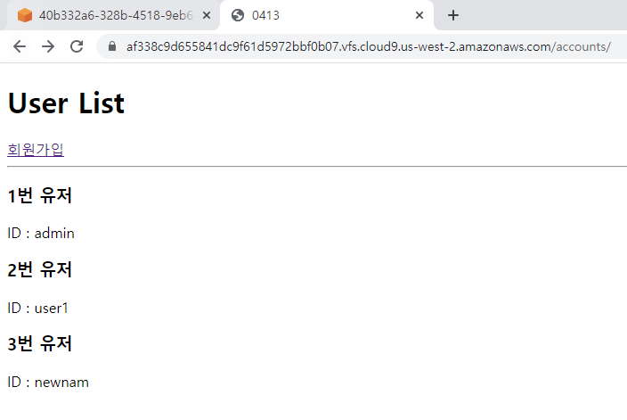
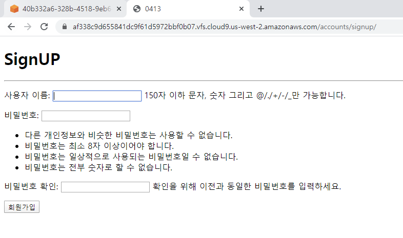

# 4월 13일 workshop

### 1. views.py

```python
from django.shortcuts import render, redirect
from django.contrib.auth import get_user_model
from django.contrib.auth.forms import UserCreationForm

User = get_user_model()


# Create your views here.
def index(request): # Read
    users = User.objects.all()
    context = {
        'users': users,
    }
    return render(request, 'accounts/index.html', context)

def signup(request):    # Create
    if request.method == "POST":
        form = UserCreationForm(request.POST)
        if form.is_valid():
            form.save()
            return redirect('accounts:index')
    else:
        form = UserCreationForm()
    context = {
        'form' : form
    }
    return render(request, 'accounts/signup.html', context)
```

* Index



* SignUp

