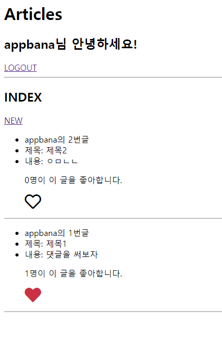

# 4월 28일 exercise

### 결과 사진




### 1. views.py

```python
from django.shortcuts import render, redirect, get_object_or_404
from .models import Article
from .forms import ArticleForm


def index(request):
    articles = Article.objects.order_by('-pk')
    context = {
        'articles': articles,
    }
    return render(request, 'articles/index.html', context)

def create(request):
    if request.method == 'POST':
        form = ArticleForm(request.POST)
        if form.is_valid():
            article = form.save(commit=False)
            article.user = request.user
            article.save()
            return redirect('articles:index')
    else:
        form = ArticleForm()
    context = {
        'form': form,
    }
    return render(request, 'articles/form.html', context)

def like(request, article_pk):
    # 게시글 가져오기
    article = get_object_or_404(Article, pk=article_pk)
    # 지금 접속한 유저
    user = request.user

    # 해당 게시글에 좋아요 누른 사람 목록 -> 목록에 존재하면 목록에서 삭제
    if article.like_users.filter(pk=user.pk).exists():
        article.like_users.remove(user) # 목록에서 삭제
    else: # 그게 아니면
        article.like_users.add(user)    # 목록에 추가
    return redirect('articles:index')

```

### 2. models.py

```python
from django.db import models
from django.conf import settings


class Article(models.Model):
    title = models.CharField(max_length=100)
    content = models.TextField()
    created_at = models.DateTimeField(auto_now_add=True)
    created_at = models.DateTimeField(auto_now=True)
    user = models.ForeignKey(settings.AUTH_USER_MODEL, on_delete=models.CASCADE)
    like_users = models.ManyToManyField(settings.AUTH_USER_MODEL, related_name='like_articles')
```

### 3. index.html

```html



  <h2>INDEX</h2>
  <a href="">NEW</a>
  
    <ul>
      <li>{{ article.user }}의 {{ article.pk }}번글</li>
      <li>제목: {{ article.title }}</li>
      <li>내용: {{ article.content }}</li>
      <!-- 특정 글의 좋아요를 누른 전체 인원수를 출력-->
      <p>{{ article.like_users.count }}명이 이 글을 좋아합니다.</p>
      <!-- 지금 접속한 유저가 게시글의 좋아요 명단에 있는지 -->
      
      <!-- 꽉찬 빨간 하트-->
      <a href=""><i class="fas fa-heart" style="font-size:2rem; color: crimson;"></i></a>
	  
      <!-- 빈 검은 하트-->
      <a href=""><i class="far fa-heart" style="font-size:2rem; color: black;"></i></a>
      
    </ul>
    <hr>
	

```

