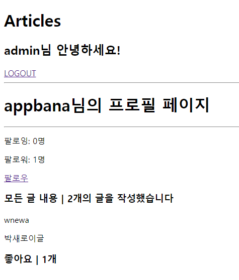

# 4월 28일 workshop

### 결과 사진




### 1. accounts/views.py

```python
from django.shortcuts import render, redirect, get_object_or_404
from django.contrib.auth.forms import UserCreationForm, AuthenticationForm
from django.contrib.auth.decorators import login_required
from django.contrib.auth import login as auth_login, logout as auth_logout, get_user_model
from .forms import CustomUserCreationForm

def signup(request):
    if request.method == 'POST':
        form = CustomUserCreationForm(request.POST)
        if form.is_valid():
            user = form.save()
            auth_login(request, user)
            return redirect('articles:index')
    else:
        form = CustomUserCreationForm()
    context = {
        'form': form,
    }
    return render(request, 'accounts/signup.html', context)

def login(request):
    if request.method == 'POST':
        form = AuthenticationForm(request, request.POST)
        if form.is_valid():
            auth_login(request, form.get_user())
            return redirect('articles:index')
    else:
        form = AuthenticationForm()
    context = {
        'form': form,
    }
    return render(request, 'accounts/login.html', context)

@login_required
def logout(request):
    auth_logout(request)
    return redirect('articles:index')

def profile(request, username):
    person = get_object_or_404(get_user_model(), username=username)
    context = { 'person': person, }
    return render(request, 'accounts/profile.html', context)

def follow(request, username):
    # 데이터 들고오기(Me & You)
    you = get_object_or_404(get_user_model(), username=username)
    me = request.user

    # 너와 내가 동일인물이 아닌 경우(내가 나를 팔로우 X)
    if you != me:
        # 너의 명단 확인해서 , 내가 있는지 없는지 검사
        if you.followers.filter(pk=me.pk).exists():
            you.followers.remove(me)
        else:
            you.followers.add(me)
    # redirect
    return redirect('accounts:profile', username)
```

### 2. accounts/models.py

```python
from django.db import models
from django.conf import settings
from django.contrib.auth.models import AbstractUser

class User(AbstractUser):
    followers = models.ManyToManyField(
        settings.AUTH_USER_MODEL,
        related_name='followings',
    )
```

### 3. profile.html

```python



<h1>{{ person.username }}님의 프로필 페이지</h1>
<hr>

<!--작성자의 팔로잉, 팔로워 숫자를 보여주고 유저의 이름을 모두 출력한다.-->
<p>팔로잉: {{ person.followings.all|length }}명</p>
<p>팔로워: {{ person.followers.all|length }}명</p>

<!--로그인한 유저 자신의 프로필 페이지에서는 팔로우 & 언팔로우 버튼이 보이지 않는다. -->

    
    <a href="">언팔로우</a>
    
    <a href="">팔로우</a>
    


<!--(선택) 해당 프로필의 유저가 작성한 모든 글의 내용과 좋아요 숫자를 보여준다.-->
<h3>모든 글 내용 | {{ person.article_set.all|length}}개의 글을 작성했습니다</h3>

<p>{{ article.title }}</p>

<h3>좋아요 | {{ person.like_articles.all|length}}개</h3>



```

