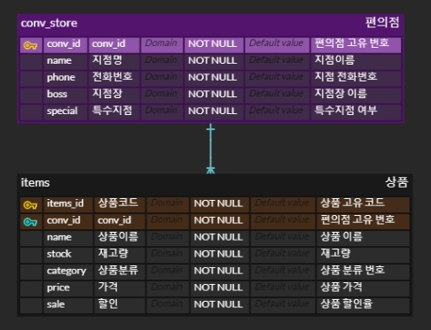

# 5월 4일 workshop

### 1. erd sreenshot



### 2. models.py

```python
from django.db import models

# Create your models here.
class Conv_Store(models.Model):
    name = models.CharField(max_length=30)
    phone = models.IntegerField()
    boss = models.CharField(max_length=30)
    special = models.BooleanField(default=False)

class Item(models.Model):
    conv_store = models.ForeignKey(Conv_Store, on_delete=models.CASCADE)
    name = models.TextField()
    stock = models.IntegerField()
    category = models.CharField(max_length=30)
    price = models.IntegerField()
    sale = models.IntegerField()
```

### 3. 설명

> 편의점별로 중요하다고 생각하는것을 제일 기본 테이블로 설정했다.
>
> boss는 지점장을 나타내며, 외국인이 지점장일 수 있어 글자수를 30까지 설정했다.
>
> special은 리조트, 역사내, 관광지 등의 특수 지점을 표현하기 위해 boolean을 썼다.

>편의점 내에서 상품에 대한 테이블을 연결했다.
>
>특히, 상품이름은 최근 별의 별 이름이 나오는 것을 고려해 따로 글자수 제한을 두지 않았다.
>
>category(상품분류)는 길게 나올 수 없기에 글자수 제한을 뒀다.
>
>sale을 통해 상품의 할인율을 나타냈다.