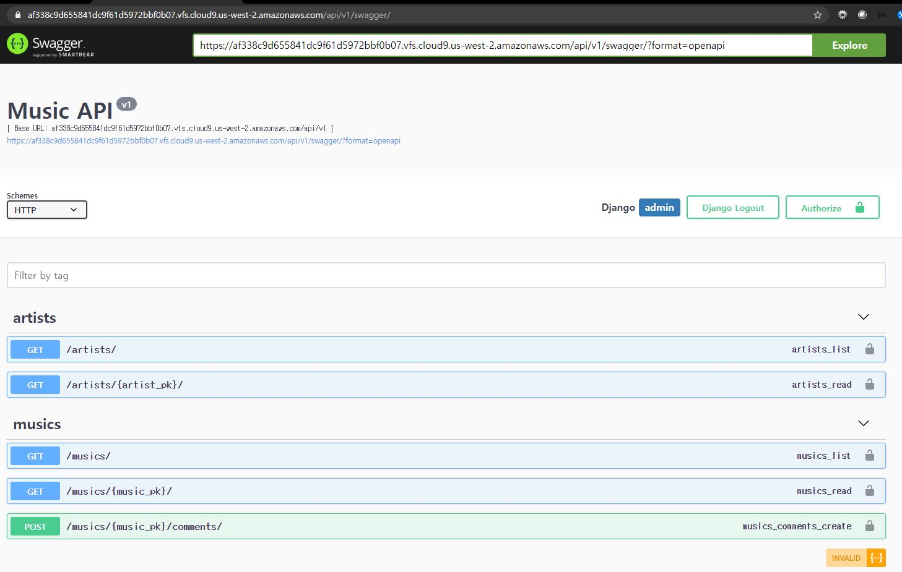

# 5월 11일 workshop



### 1. views.py

```python
from django.shortcuts import render, get_object_or_404
from rest_framework.decorators import api_view
from rest_framework.response import Response

from .models import Music, Artist
from .serializers import MusicSerializer, ArtistSerializer, ArtistDetailSerializer, CommentSerializer

@api_view(['GET'])
def music_list(request):
    musics = Music.objects.all()
    serializer = MusicSerializer(musics, many=True)
    return Response(serializer.data)

@api_view(['GET'])
def music_detail(request, music_pk):
    music = get_object_or_404(Music, pk=music_pk)
    serializer = MusicSerializer(music)
    return Response(serializer.data)

@api_view(['GET'])
def artist_list(request):
    artists = Artist.objects.all()
    serializer = ArtistSerializer(artists, many = True)
    return Response(serializer.data)

@api_view(['GET'])
def artist_detail(request, artist_pk):
    artist = get_object_or_404(Artist, pk=artist_pk)
    serializer = ArtistDetailSerializer(artist)
    return Response(serializer.data)

@api_view(['POST'])
def comments_create(request, music_pk):
    serializer = CommentSerializer(data=request.data)
    if serializer.is_valid():
        serializer.save(music_id=music_pk)
    return Response(serializer.data)
```


### 2. serializers.py

```python
from rest_framework import serializers
from .models import Music, Artist, Comment

class MusicSerializer(serializers.ModelSerializer):
    class Meta:
        model = Music
        fields = ['id', 'title', 'artist_id']

class ArtistSerializer(serializers.ModelSerializer):
    class Meta:
        model = Artist
        fields = ['id', 'name']

class ArtistDetailSerializer(serializers.ModelSerializer):
    musics = MusicSerializer(source='music_set', many=True)
    musics_count = serializers.IntegerField(source='music_set.count')

    class Meta:
        model = Artist
        fields = ['id', 'name', 'musics', 'musics_count']

class CommentSerializer(serializers.ModelSerializer):
    class Meta:
        model = Comment
        fields = ['id', 'content', 'music_id']
```
